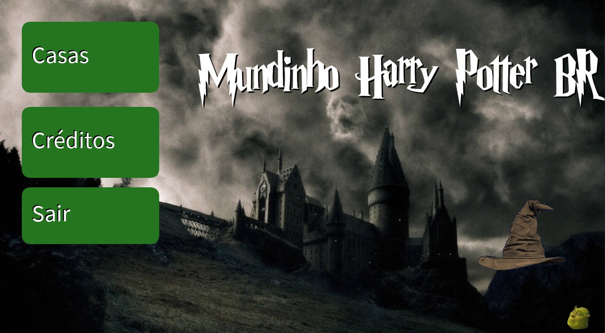
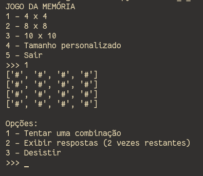
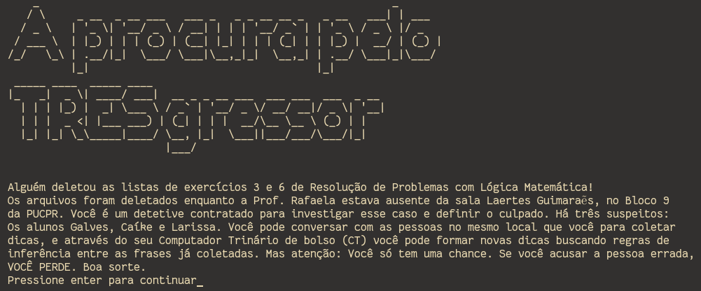

# Gabriel Moura

Atualmente sou estudante de Ciência da Computação na Pontifícia Universidade Católica do Paraná (PUC-PR).
Me interesso pela área de tecnologia desde muito jovem, mas idealizei seguir vários caminhos diferentes, muitos
pouco relacionados com meu curso atual, antes de decidir seguir nessa área.

## Projetos

### Second Nature
Second Nature é um jogo que mistura tiro com plataforma e envolve uma história de investigação.

### Mundinho Harry Potter BR
Um aplicativo para os fãs da série de livros Harry Potter.

 

### Jogo da Memória
Jogo feito em python que roda um jogo da memória customizável no terminal.

  

### A Procura Pelo TRÊSgressor
Uma aventura em texto onde você deve procurar quem deletou as listas 3 e 6 da matéria
de Resolução de Problemas com Lógica Matemática

  

