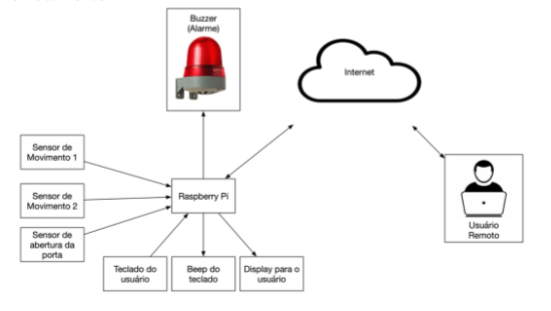

# Gabriel Moura

Atualmente sou estudante de Ciência da Computação na Pontifícia Universidade Católica do Paraná (PUC-PR).
Me interesso pela área de tecnologia desde muito jovem, mas idealizei seguir vários caminhos diferentes, muitos
pouco relacionados com meu curso atual, antes de decidir seguir nessa área.

# Projetos

## Experiência Criativa - Navegando na Computação

### Second Nature
Second Nature é um jogo que mistura tiro com plataforma e envolve uma história de investigação.

### Mundinho Harry Potter BR
Um aplicativo para os fãs da série de livros Harry Potter.

 

## Raciocínio Algorítmico

### Jogo da Memória
Jogo feito em Python que roda um jogo da memória customizável no terminal.

  

### Jokenpô
Jogo de Jokenpô (Pedra, Papel e Tesoura) feito em Python.

  

## Resolução de Problemas com Lógica Matemática

### A Procura Pelo TRÊSgressor
Uma aventura em texto onde você deve procurar quem deletou as listas 3 e 6 da matéria
de Resolução de Problemas com Lógica Matemática

  

## Fundamentos de Sistemas Ciberfísicos

### Projeto Smart City
Esse projeto consiste em criar uma solução inteligente para um problema presente nas cidades,
utilizando a tecnologia do Raspberry Pi.

  

## Filosofia

### Minha Vida Universitária
Projeto sobre reflexão e planejamento da minha vida como universitário.

  

